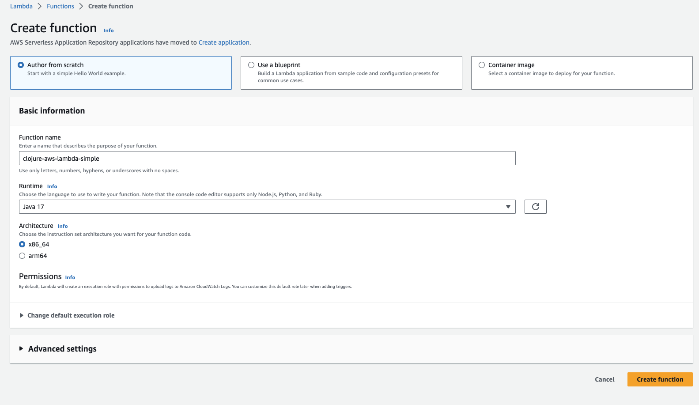
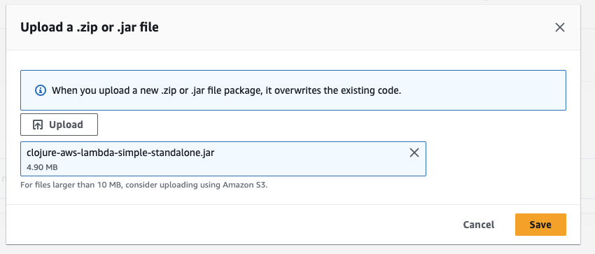
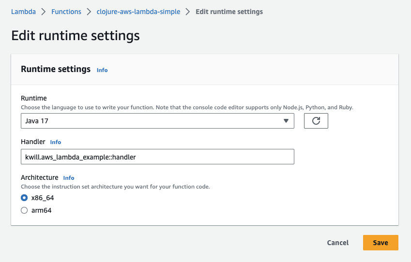
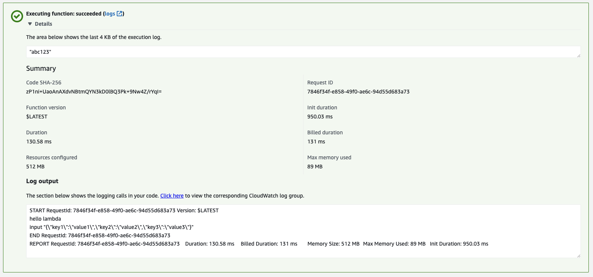

# clojure-aws-lambda-simple

Example project showing the simplest way to write an AWS Lambda function in Clojure. 
No framework. 

## Usage

First, build the project. This will create an uberjar in the target directly.  
```shell
clojure -T:build all
```

```shell
ls -l target/clojure-aws-lambda-simple-standalone.jar
-rw-r--r--  1 kenny  admin  4903651 Jul 26 16:13 target/clojure-aws-lambda-simple-standalone.jar
```

Only 4.9mb 😎 

Now we create the Lambda function with ClickOps. In a prod case, use infra as code.
AWS will almost certainly update their UI more often than this example needs to change (hopefully never).

Input a function name and choose Java 17 (or whatever you'd prefer). Ensure x86_64 is checked.


Now upload the jar file we build previously. In prod, you'll likely reference an object in S3. 



Set the runtime settings for the function to point to the correct handler. Note that `-` are replaced with `_`.
 


Send a test event to your handler and observe the expected return value and printed output. 


